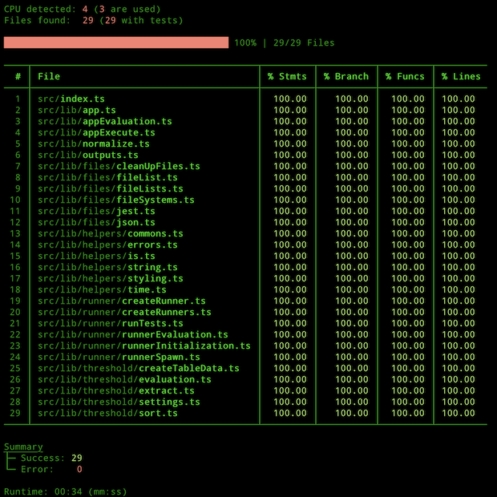

# Jest: Coverage per file

## Table of Contents

- [Installation](#installation)
- [Introduction](#introduction)
- [Philosophy behind the project](#philosophy-behind-the-project)
- [Commands](#commands)

## Installation

```bash
# locale
npm install -D jest-cpf

# glboale
npm install -g jest-cpf
```

## Introduction

`jest-cpf` generates one coverage per file, so that the value is not corrupted by dependencies.

```bash
jest-cpf --config <path-to-jest-config>
```

All arguments from the call are passed 1-to-1 to Jest.

The following options are read from the jest config file:

- `testMatch`
- `collectCoverageFrom`
- `coverageDirectory` _(optional)_
- `coveragePathIgnorePatterns` _(optional)_
- `coverageThreshold.global` _(optional, default value 95%)_

### Example



## Philosophy behind the project

The best and fastest way to test is to use Unit Tests.
All dependencies of a function or class are mocked, so very simple tests can be written.
A disadvantage of my opinion is that the interface/interaction with the dependency is not tested.

During Integration Tests, a large part of the application or library is tested and only external dependencies (e.g. database) are mocked.
This makes it very difficult to test all code paths and it is time intensive.

In my opinion, the combination of both types is the best way.
So we write "unit tests", but with the enhancement that the direct dependencies of the function/class are not mocked (external dependencies (e.g. database) are always mocked here).

When creating coverage with unit tests, it is clear which code blocks or paths have not yet been tested.
With the combination it is no longer clear which function/class has been tested directly or indirectly (i.e. as a dependency).

For this reason I wrote this tool that generates the coverage per test file and creates an overview.
Due to the flexibility of JavaScript it is very easy to achieve a coverage of 100%.
This should also be used as a minimum guideline.
Of course, regardless of the coverage value, logical and meaningful tests must be written.
The 100% coverage value only guarantees that each code path has been tested at least once.
How meaningful the test is is the programmer's responsibility.

The tool does not evaluate whether a test is successful or not.

## Commands

| Command              | Type  | Description                             |
| -------------------- | ----- | --------------------------------------- |
| `npm run build`      | Build | Build the library                       |
| `npm run test`       | Test  | Run all tests                           |
| `npm run test:watch` | Test  | Watching mode from test                 |
| `npm run coverage`   | Test  | Create the coverage table (this tool)   |
| `npm run lint`       | Lint  | Checks if the eslint rules are followed |
